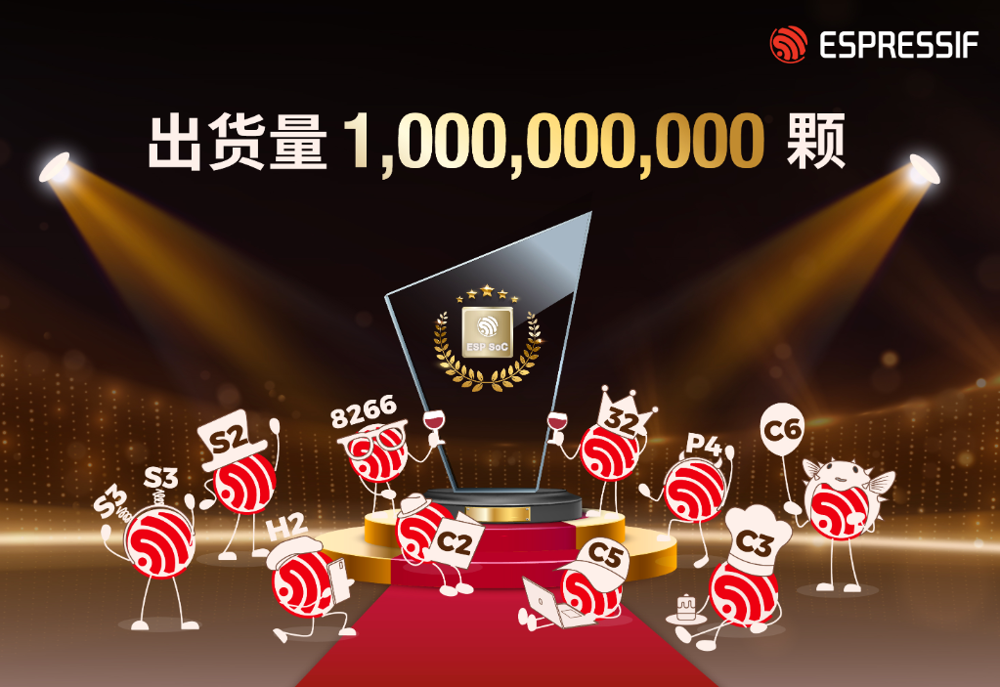
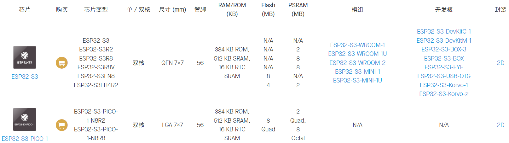
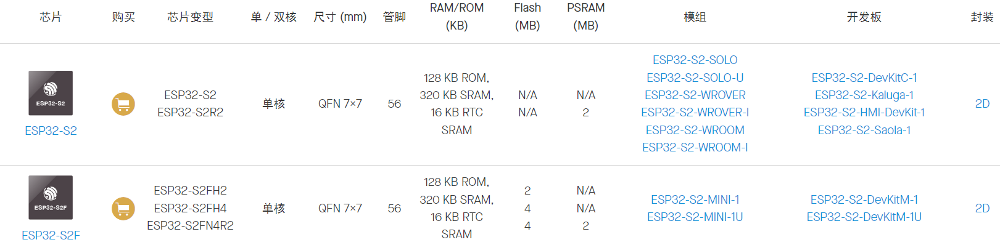
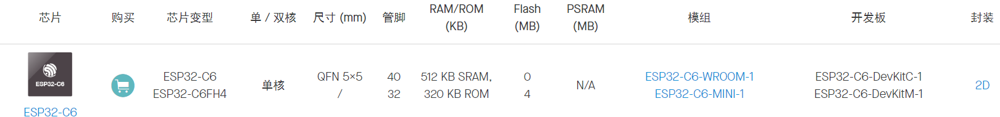
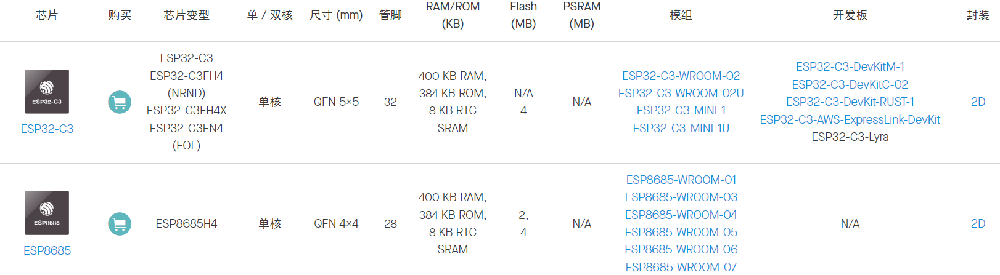
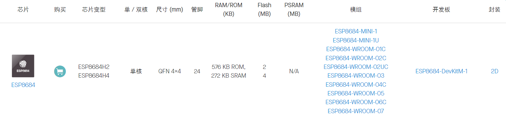
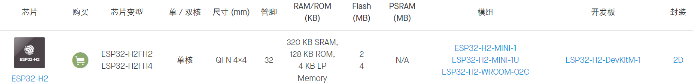
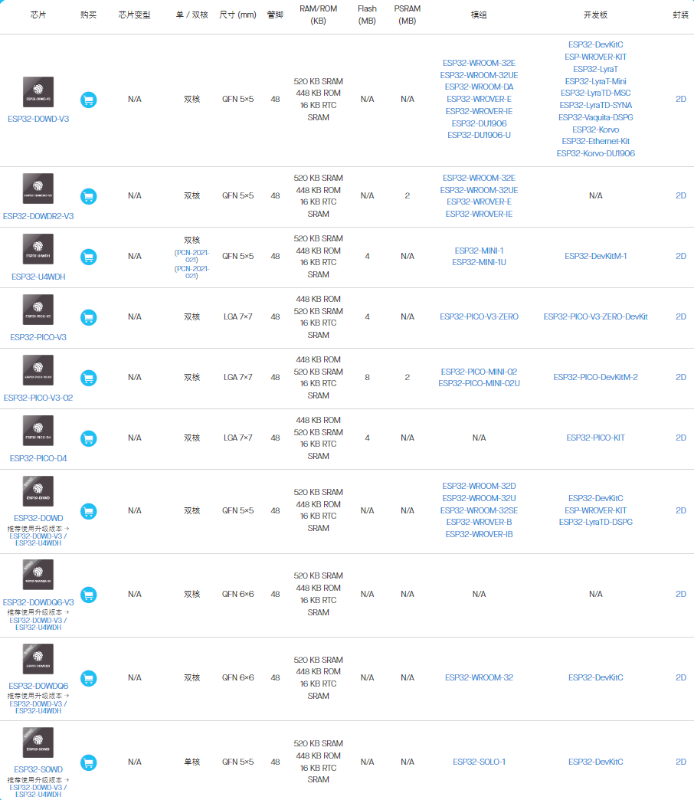
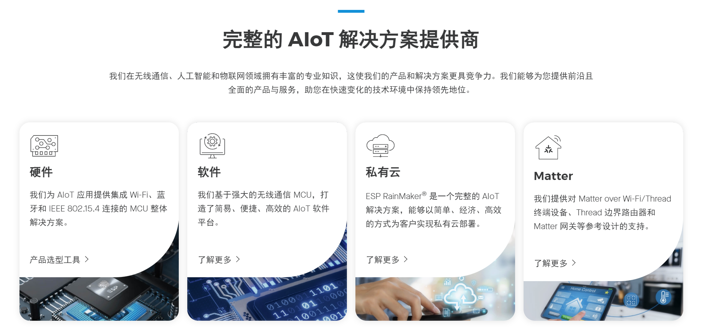
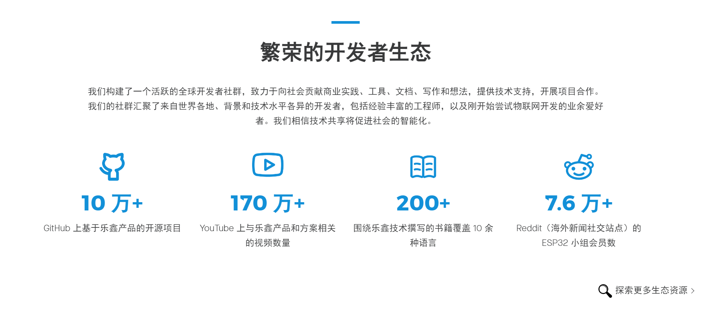

# 乐鑫 IoT 芯片全球出货量突破 10 亿颗

------

# 产品概述

产品选型工具：[ESP Product Selector (espressif.com)](https://products.espressif.com/#/product-selector?language=zh&names=)

------

## ESP32-S 系列

### ESP32-S3 系列      [硬件设计指南](https://www.espressif.com.cn/sites/default/files/documentation/esp32-s3_hardware_design_guidelines_cn.pdf)

**32-bit MCU & 2.4 GHz Wi-Fi & Bluetooth 5 (LE)**

- Xtensa® 32 位 LX7 双核处理器，主频高达 240 MHz
- 内置 512 KB SRAM、384 KB ROM 存储空间，并支持多个外部 SPI、Dual SPI、 Quad SPI、Octal SPI、QPI、OPI flash 和片外 RAM
- 额外增加用于加速神经网络计算和信号处理等工作的向量指令 (vector instructions)
- 45 个可编程 GPIO，支持常用外设接口如 SPI、I2S、I2C、PWM、RMT、ADC、UART、SD/MMC 主机控制器和 TWAITM 控制器等
- 基于 AES-XTS 算法的 Flash 加密和基于 RSA 算法的安全启动，数字签名和 HMAC 模块，“世界控制器 (World Controller)”模块

***

### ESP32-S2 系列      [硬件设计指南](https://www.espressif.com.cn/sites/default/files/documentation/esp32-s2_hardware_design_guidelines_cn.pdf)

**32-bit MCU & 2.4 GHz Wi-Fi**

- 单核 CPU 时钟频率高达 240 MHz
- 支持多种低功耗工作状态：精细时钟门控、动态电压时钟频率调节
- 安全机制：eFuse 存储、安全启动、Flash 加密、数字签名，支持 AES、SHA 和 RSA 算法
- 外设包括 43 个 GPIO 口，1 个全速 USB OTG 接口，SPI，I2S，UART，I2C，LED PWM，LCD 接口，Camera 接口，ADC，DAC，触摸传感器
- 可对接丰富的网络云平台、拥有通用的产品特性，极大缩短产品构建与上市时间

***

## ESP32-C 系列

### ESP32-C6 系列      [硬件设计指南](https://www.espressif.com.cn/sites/default/files/documentation/esp32-c6_hardware_design_guidelines_cn.pdf)

**32-bit RISC-V MCU & 2.4 GHz Wi-Fi 6 & Bluetooth 5 (LE) & IEEE 802.15.4** 

- RISC-V 32 位单核处理器，主频高达 160 MHz
- 行业领先的低功耗性能和射频性能
- 内置 320 KB ROM，512 KB SRAM，16 KB 低功耗 SRAM，支持外接 flash
- 30 个 (QFN40) 或 22 个 (QFN32) 可编程 GPIO 管脚，支持 SPI、UART、I2C、I2S、RMT、TWAI 和 PWM

***

### ESP32-C3 系列      [硬件设计指南](https://www.espressif.com.cn/sites/default/files/documentation/esp32-c3_hardware_design_guidelines_cn.pdf)

**32-bit RISC-V MCU & 2.4 GHz Wi-Fi & Bluetooth 5 (LE)** 

- RISC-V 32 位单核处理器，四级流水线架构，主频高达 160 MHz
- 行业领先的低功耗性能和射频性能
- 内置 400 KB SRAM、384 KB ROM 存储空间，并支持多个外部 SPI、Dual SPI、Quad SPI、QPI flash
- 完善的安全机制：基于 RSA-3072 算法的安全启动、基于 AES-128-XTS 算法的 flash 加密、创新的数字签名和 HMAC 模块、支持加密算法的硬件加速器
- 丰富的通信接口及 GPIO 管脚，可支持多种场景及复杂的应用

***

### ESP32-C2 系列      [硬件设计指南](https://www.espressif.com.cn/sites/default/files/documentation/esp8684_hardware_design_guidelines_cn.pdf)

**32-bit RISC-V MCU & 2.4 GHz Wi-Fi & Bluetooth 5 (LE)** 

- RISC-V 32 位单核处理器，主频高达 120 MHz
- 行业领先的低功耗性能和射频性能
- 内置 272 KB SRAM（其中 16 KB 专用于 cache）、576 KB ROM 存储空间
- 14 个可编程 GPIO 管脚：SPI、UART、I2C、LED PWM 控制器、SAR 模/数转换器、温度传感器

***

## ESP32-H 系列

### ESP32-H2 系列

**32-bit RISC-V MCU & Bluetooth 5 (LE) & IEEE 802.15.4**
- 32-bit RISC-V 32 位单核处理器，主频高达 96 MHz
- 320 KB SRAM、128 KB ROM 存储空间，4 KB LP Memory，支持外接 flash
- 19 个可编程 GPIO，支持常用外设接口如 UART、SPI、I2C、I2S、红外收发器、LED PWM、全速 USB 串口/JTAG 控制器、GDMA、MCPWM
- 可用于构建 Thread 终端设备；与其他 Wi-Fi SoC 结合可构建 Thread 边界路由器、Matter 网桥

***

## ESP32 系列      [硬件设计指南](https://www.espressif.com.cn/sites/default/files/documentation/esp32_hardware_design_guidelines_cn.pdf)

**32-bit MCU & 2.4 GHz Wi-Fi & Bluetooth/Bluetooth LE**

- 两个或一个可以单独控制的 CPU 内核，时钟频率可调，范围从 80 MHz 到 240 MHz
- +19.5 dBm 天线端输出功率，确保良好的覆盖范围
- 传统蓝牙支持 L2CAP，SDP，GAP，SMP，AVDTP，AVCTP，A2DP (SNK) 和 AVRCP (CT) 协议
- 低功耗蓝牙 (Bluetooth LE) 支持 L2CAP, GAP, GATT, SMP, 和 GATT 之上的 BluFi, SPP-like 协议等
- 低功耗蓝牙连接智能手机，发送低功耗信标，方便检测
- 睡眠电流小于 5 μA，适用于电池供电的可穿戴电子设备
- 外设包括电容式触摸传感器，霍尔传感器，SD 卡接口，以太网，高速 SPI，UART，I2S 和 I2C

***

# More

***

# 参考资料

> - [专业支持服务｜乐鑫科技 (espressif.com.cn)](https://www.espressif.com.cn/zh-hans/support/services#self-service-resource)
> - [无线通信 SoC、软件、云和 AIoT 方案｜乐鑫科技 (espressif.com.cn)](https://www.espressif.com.cn/zh-hans)
> - [ESP Product Selector (espressif.com)](https://products.espressif.com/#/product-selector?language=zh&names=)
> - [芯片概览｜乐鑫科技 (espressif.com.cn)](https://www.espressif.com.cn/zh-hans/products/socs)
> - [模组概览 | 乐鑫科技 (espressif.com.cn)](https://www.espressif.com.cn/zh-hans/products/modules)
> - [开发板概览｜乐鑫科技 (espressif.com.cn)](https://www.espressif.com.cn/zh-hans/products/devkits)
> - [产测配件｜乐鑫科技 (espressif.com.cn)](https://www.espressif.com.cn/zh-hans/products/equipment/production-testing-equipment/overview)
> - [ESP-IDF 物联网开发框架｜乐鑫科技 (espressif.com.cn)](https://www.espressif.com.cn/zh-hans/products/sdks/esp-idf)
> - [乐鑫 Matter 方案｜乐鑫科技 (espressif.com.cn)](https://www.espressif.com.cn/zh-hans/solutions/device-connectivity/esp-matter-solution#sdk-for-matter)
> - [ESP-Mesh-Lite 方案｜乐鑫科技 (espressif.com.cn)](https://www.espressif.com.cn/zh-hans/sdks/esp-mesh-lite)
> - [ESP RAINMAKER | ESP RAINMAKER (espressif.com)](https://rainmaker.espressif.com/zh-hans/)
> - [espressif/esp-homekit-sdk (github.com)](https://github.com/espressif/esp-homekit-sdk)
> - [espressif/arduino-esp32: Arduino core for the ESP32 (github.com)](https://github.com/espressif/arduino-esp32)
> - [espressif/esp-at: AT application for ESP32/ESP32-C2/ESP32-C3/ESP32-C6/ESP8266 (github.com)](https://github.com/espressif/esp-at)
> - [espressif/esp-hosted: Hosted Solution (Linux/MCU) with ESP32 (Wi-Fi + BT + BLE) (github.com)](https://github.com/espressif/esp-hosted)
> - [espressif/esp-adf: Espressif Audio Development Framework (github.com)](https://github.com/espressif/esp-adf)
> - [esp32-s3_datasheet_cn.pdf (espressif.com.cn)](https://www.espressif.com.cn/sites/default/files/documentation/esp32-s3_datasheet_cn.pdf)
> - [esp32-s3-pico-1_datasheet_cn.pdf (espressif.com.cn)](https://www.espressif.com.cn/sites/default/files/documentation/esp32-s3-pico-1_datasheet_cn.pdf)
> - [esp32-s2_datasheet_cn.pdf (espressif.com.cn)](https://www.espressif.com.cn/sites/default/files/documentation/esp32-s2_datasheet_cn.pdf)
> - [esp32-c6_datasheet_cn.pdf (espressif.com.cn)](https://www.espressif.com.cn/sites/default/files/documentation/esp32-c6_datasheet_cn.pdf)
> - [esp32-c3_datasheet_cn.pdf (espressif.com.cn)](https://www.espressif.com.cn/sites/default/files/documentation/esp32-c3_datasheet_cn.pdf)
> - [esp8685_datasheet_cn.pdf (espressif.com.cn)](https://www.espressif.com.cn/sites/default/files/documentation/esp8685_datasheet_cn.pdf)
> - [esp8684_datasheet_cn.pdf (espressif.com.cn)](https://www.espressif.com.cn/sites/default/files/documentation/esp8684_datasheet_cn.pdf)
> - [esp32-h2_datasheet_cn.pdf (espressif.com.cn)](https://www.espressif.com.cn/sites/default/files/documentation/esp32-h2_datasheet_cn.pdf)
> - [esp32_datasheet_cn.pdf (espressif.com.cn)](https://www.espressif.com.cn/sites/default/files/documentation/esp32_datasheet_cn.pdf)
> - [esp32-pico-d4_datasheet_cn.pdf (espressif.com.cn)](https://www.espressif.com.cn/sites/default/files/documentation/esp32-pico-d4_datasheet_cn.pdf)
> - [esp32-pico-v3_datasheet_cn.pdf (espressif.com.cn)](https://www.espressif.com.cn/sites/default/files/documentation/esp32-pico-v3_datasheet_cn.pdf)
> - [esp32-pico-v3-02_datasheet_cn.pdf (espressif.com.cn)](https://www.espressif.com.cn/sites/default/files/documentation/esp32-pico-v3-02_datasheet_cn.pdf)
> - [ESP32 Forum - Index page](https://www.esp32.com/)
> - [2024 乐鑫科技开发者大会 (espressif.com)](https://devcon.espressif.com/zh-cn)
> - [社区资源 - 技术书籍｜乐鑫科技 (espressif.com.cn)](https://www.espressif.com.cn/zh-hans/ecosystem/community-engagement/books)
> - [ESP 技术文章 - 知乎 (zhihu.com)](https://www.zhihu.com/column/c_1338146241045860353)
> - [亚马逊云高级技术合作伙伴｜乐鑫科技 (espressif.com.cn)](https://www.espressif.com.cn/zh-hans/ecosystem/partnership-and-resource/aws-advanced-technology-partner)
> - [乐鑫合作伙伴｜乐鑫科技 (espressif.com.cn)](https://www.espressif.com.cn/zh-hans/ecosystem/partnership-and-resource/third-party-platforms)
> - [第三方 SDK｜乐鑫科技 (espressif.com.cn)](https://www.espressif.com.cn/zh-hans/ecosystem/partnership-and-resource/third-party-sdks)

