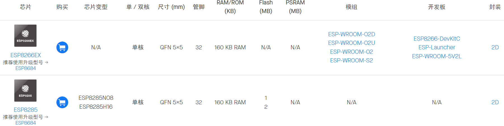

# 乐鑫 IoT 芯片全球出货量突破 10 亿颗

***

# 产品概述

产品选型工具：[ESP Product Selector (espressif.com)](https://products.espressif.com/#/product-selector?language=zh&names=)

------

## ESP8266 系列

### ESP8266 芯片      [硬件设计指南](https://www.espressif.com.cn/sites/default/files/documentation/esp8266_hardware_design_guidelines_cn.pdf)

**32-bit MCU & 2.4 GHz Wi-Fi**

- 单核 CPU 时钟频率高达 160 MHz
- +19.5 dBm 天线端输出功率，确保良好的覆盖范围
- 睡眠电流小于 20 μA，适用于电池供电的可穿戴电子设备
- 外设包括 UART，GPIO，I2S，I2C，SDIO，PWM，ADC 和 SPI

***

# More

***

# 参考资料

> - [ESP8266 Wi-Fi SoC｜乐鑫科技 (espressif.com.cn)](https://www.espressif.com.cn/zh-hans/products/socs/esp8266)
> - [esp8266ex_datasheet_cn (espressif.com.cn)](https://www.espressif.com.cn/sites/default/files/documentation/0a-esp8266ex_datasheet_cn.pdf)
> - [esp8285_datasheet_cn (espressif.com.cn)](https://www.espressif.com.cn/sites/default/files/documentation/0a-esp8285_datasheet_cn.pdf)
> - [esp8684_datasheet_cn.pdf (espressif.com.cn)](https://www.espressif.com.cn/sites/default/files/documentation/esp8684_datasheet_cn.pdf)

