***

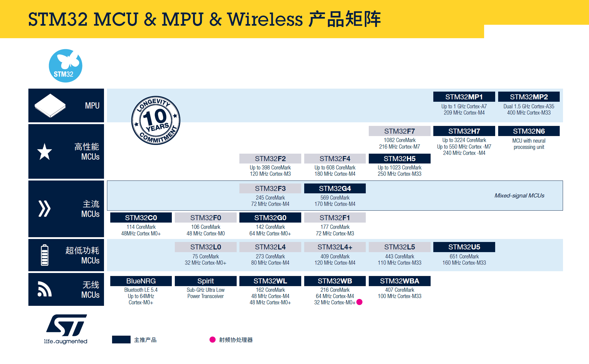

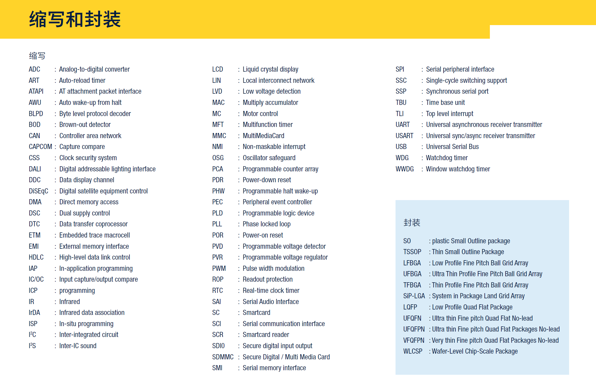

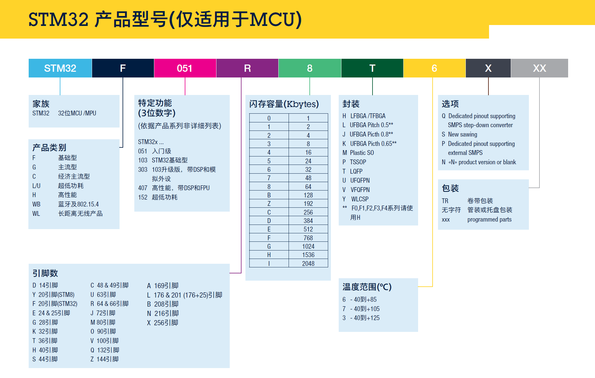

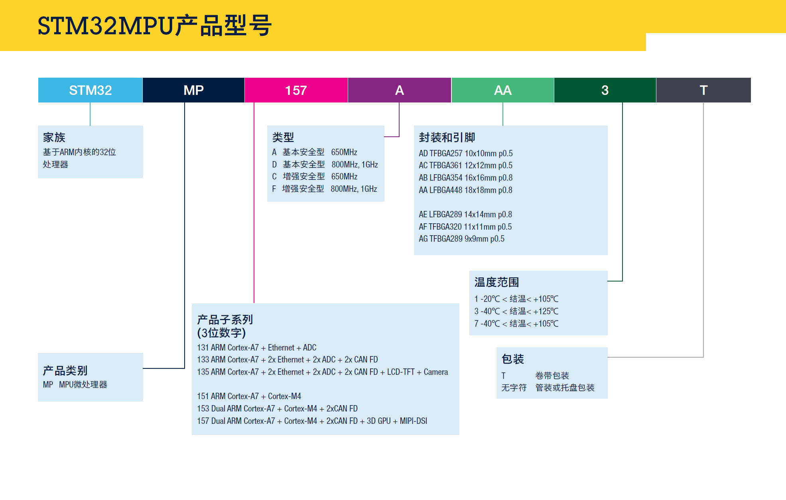

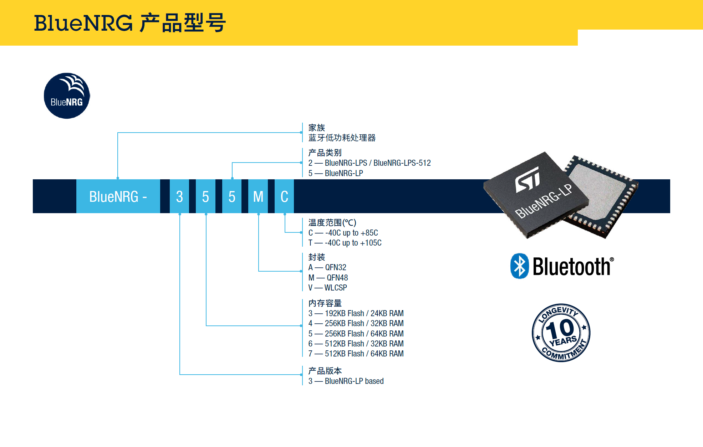

------

# STM32 ARM Cortex 32位微控制器

意法半导体公司（STMicroelectronics，ST）基于 ARM 公司的 Cortex-M 内核设计生产的 STM32 系列单片机是目前应用最广泛的 32 位单片机。

基于ARM® Cortex® 内核的 32位微控制器和微处理器STM32产品家族，为MCU和MPU用户开辟了一个全新的自由开发空间，并提供了各种易于上手的软硬件辅助工具。

STM32 MCU和MPU融高性能、实时性、数字信号处理、低功耗、低电压于一身，同时保持高集成度和开发简易的特点。

业内最强大的产品阵容，基于工业标准的处理器，大量的软硬件开发工具，让STM32成为各类中小项目和完整平台解决方案的理想选择。

 STM32 的产品线非常丰富，最新的（2024年）STM32系列产品线如下图所示。

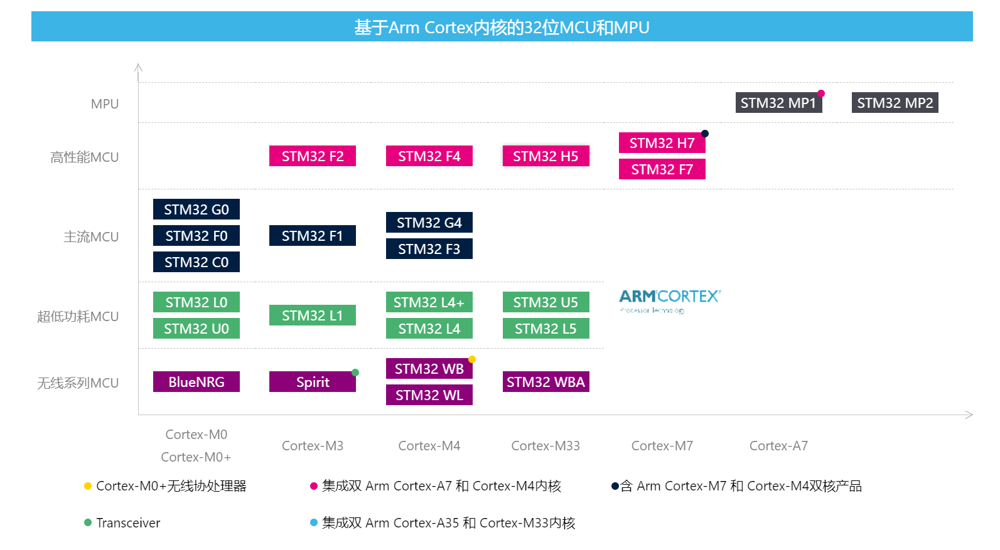

**上图可分为两大类：**

1. **基于 ARM Cortex-M 系列内核的微控制器单元（Microcontroller Unit，MCU），也就是常说的单片机。 MCU 一般只有一个处理器内核，少数型号有两个内核。**
2. **具有 Cortex-M4 和双 Cortex-A7 核的微处理器单元（Microprocessor Unit， MPU）。**

STM32 MPU 是 ST 公司在 2019 年年初才推出的新产品。它的 Cortex-A7 内核上可以运行 OpenSTLinux 系统，用于实现高级应用程序。它的 Cortex-M4 内核可以面向硬件实现底层功能。

常用的 STM32 器件指的是 STM32 系列 32 位 MCU 。 STM32 系列 MCU 推出的时间比较久，应用广泛，各类设计资源和资料也比较多。 STM32 系列 MCU 是基于 ARM Cortex-M 系列内核设计的， ARM Cortex-M 是面向嵌入式应用的 32 位内核，分为 M0、M0+、M3、M4、M33、M7 等系列。这些内核的性能逐渐增强，当然，它们的功耗也逐渐增大。

**图中 STM32 系列 MCU 在纵轴方向分为以下几个系列：**

1. **无线 MCU。STM32WL 系列 MCU 集成了 sub-GHz 无线控制单元，支持多种调制模式，能够采用 LoRaWAN 或任何其他合适的协议。 STM32WB 系列是 2.4GHz 无线通信双核 MCU，一个 M0+ 内核作为网络处理器，一个 M4 内核作为应用处理器，支持 Bluetooth 5 、802.15.4 网络，支持 BLE5 、ZigBee 3 等无线通信协议栈。**
2. **超低功耗 MCU。 STM32L 系列是超低功耗系列 MCU，使用不同的 Cortex-M 内核，超低功耗系列 STM32MCU 适用于对功耗敏感的应用。**
3. **主流 MCU。主流系列 MCU 在功耗和性能方面比较均衡，主频最高能到 72MHz 。例如，市面上比较畅销的基于 STM32F103 的开发板，主要是价格便宜，外设丰富。**
4. **高性能 MCU 。高性能系列用于对处理速度和性能要求比较高的应用，比如需要进行数字信号处理或实现图形用户界面的应用。Cortex-M4 和 Cortex-M7 系列内核带有浮点数单元（Float Point Unit，FPU），具有数字信号处理（Digital Signal Processing，DSP）指令集，所以 STM32F4、STM32F7、STM32H7系列可用于对性能要求较高的应用。**

每个系列的 MCU 又有很多具体的型号，具有不同大小的 Flash 存储器和 SRAM 内存，且具有不同的外设，例如， STM32F4 系列有十几个具体的型号，这为设计选型提供了方便。此外， STM32 的系列之间一般还有引脚相容的型号，例如，一个 STM32F2 系列的某个型号可以找到一个引脚相容的 STM32F4 型号，这也为更改设计提供了方便。

因为 STM32 系列 MCU 都是基于 Cortex-M 内核的，所以它们的代码在二进制级别是兼容的。 ST 公司为每个系列的 MCU 提供了驱动库，代码级别的兼容性也比较好。 STM32 系列有 450 多种具体型号，在将一种型号上的设计迁移到另一种型号上时，代码上的迁移是比较容易的。

 STM32 系列 MCU 型号丰富，适用于各种应用场合，可以替代各种传统单片机的功能。此外， STM32 系列的软件开发方式统一，学会一种型号的 STM32 MCU 的开发后，再换用其他型号的 STM32 MCU 进行开发也是类似的，可降低学习的时间成本。

------

# STM32 驱动库

ST 公司为 STM32 MCU 的软件开发提供了器件的驱动程序，使得 MCU 的软件开发基本不用直接与 MCU 的寄存器打交道。到目前为止， STM32 的器件驱动库有两种：一种是最早随着 STM32 MCU 推出的标准外设库（Standard Peripheral Library，SPL）简称标准库；另一种是在 2014 年推出的硬件抽象层／底层（Hardware Abstract Layer／Low-layer，HAL／LL）库。

**ST 公司已经停止更新 SPL ，新型号的 MCU 和 MPU 只有 HAL／LL 库，所以新的设计应该采用 HAL／LL 库。**

## SPL 库

ST 公司为一些早期型号的 STM32 MCU 提供标准外设库。标准外设库就是一套基于 ANSI-C 语言的 MCU 驱动程序源代码，它覆盖了如下 3 个抽象层：

1. **用C语言定义的全部寄存器的地址映射，包括所有的位、位带（bit field）和寄存器。开发者无须自己再定义寄存器地址映射，减少了工作量，也避免出现底层错误。**
2. **覆盖所有外设功能的API驱动函数和数据结构定义，还包括具体内核相关的宏定义和数据类型定义。**
3. **用于多种开发工具链的项目模板，和众多的覆盖所有可用外设的示例程序。**

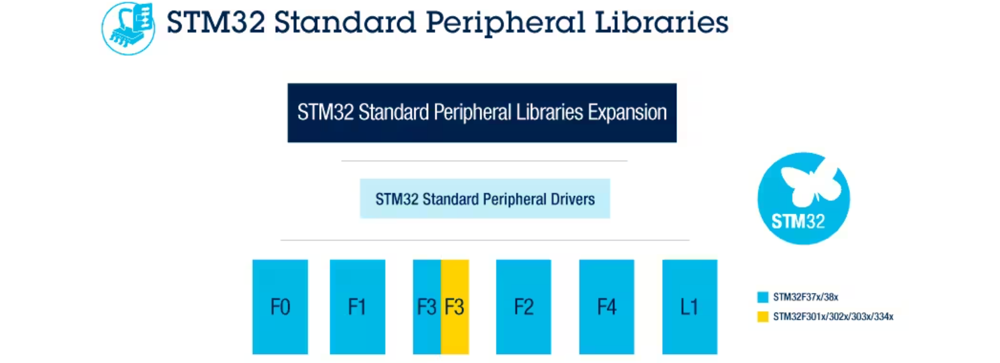
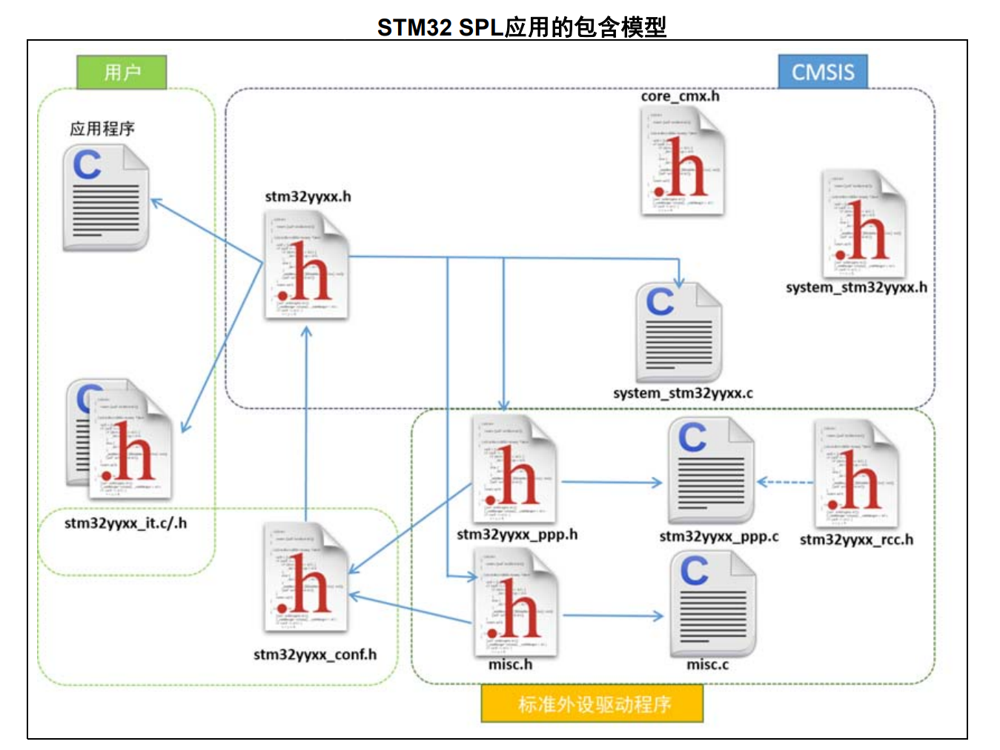

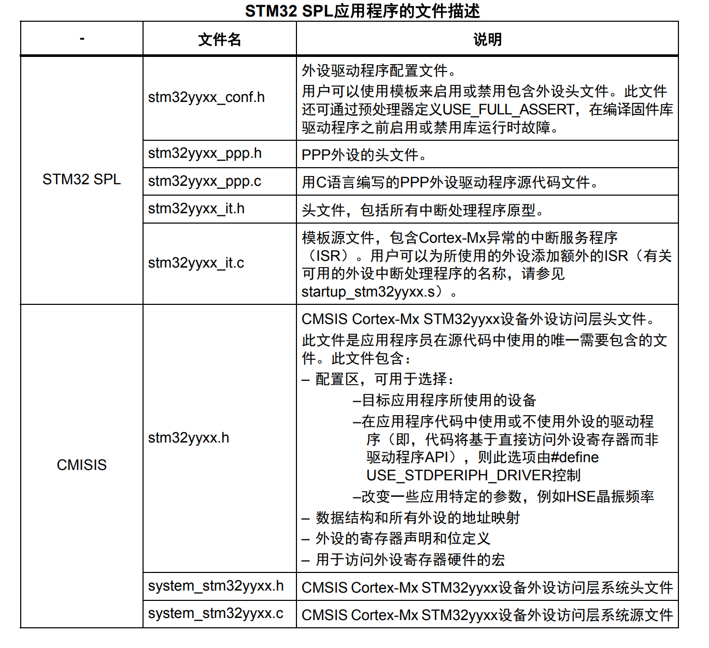

 SPL 中有 ARM 公司为 Cortex-M 内核提供的 Cortex 微控制器软件接口标准（Cortex Microcontroller Software Interface Standard，CMSIS）编程接口，这是 ARM 公司为具体的 Cortex 内核定义的标准编程接口。

 SPL 提供了一个 MCU 所有片上资源和外设的基本驱动，如寄存器地址映射，GPIO、ADC、SPI、USART 等外设的驱动。各系列 MCU 的驱动程序都使用基本相同的 API ，也就是说，驱动程序的结构、函数名、参数名称基本相同。驱动程序源码是用严格的 ANSI-C 语言编写的，因此与具体的编译工具无关，只有器件的启动文件与具体的编译器有关。

使用 SPL 编程与常规单片机编程不一样，一般不需要直接操作寄存器，而是通过 API 函数进行操作。这降低了编程难度，而且因为采用了相同的 API 函数接口，比较容易将程序从一种器件迁移到另一种器件。

除标准外设库，ST 公司还提供标准外设库的一些扩展包，如 USB OTG 驱动程序、 TCP/IP 协议栈等。还有一些第三方的库，如嵌入式操作系统 FreeRTOS 、文件系统FatFS 、图形用户界面等。

相对于传统的单片机从寄存器开始的编程方式， STM32的标准库编程方式进步了很多。从 MCS-51 或 MSP430 单片状库境程的读者，对此会深有体会。

## HAL / LL 库

2014 年，ST 公司推出了 STM32 器件的另一种驱动库，即 HAL／LL 库，并推出了一个配套的 MCU  图形化配置软件 STM32CubeMX 。每一个 STM32 系列 MCU 有一个 HAL／LL 库，其本 质功能与 SPL 是一样的，也是为器件提供硬件驱动程序和各种中间件。HAL／LL 库实际上包含两类驱动程序。

1. **硬件抽象层（Hardware Abstract Layer，HAL）驱动程序。HAL 比 SPL 的抽象性更好， HAL 的所有 API 具有统一的接口，基于 HAL 的程序在 STM32 的整个系列内迁移更容易。由于 HAL 的抽象性更强，封装性更好，因此其代码冗余度更高，运行效率低一些。**
2. **底层（Low-layer， LL）驱动程序。LL 驱动程序是面向底层的更快的轻量化编程接口。LL 可以弥补  HAL 的不足，在某些对运行效率要求较高的场合，可以使用 LL 替代 HAL。**

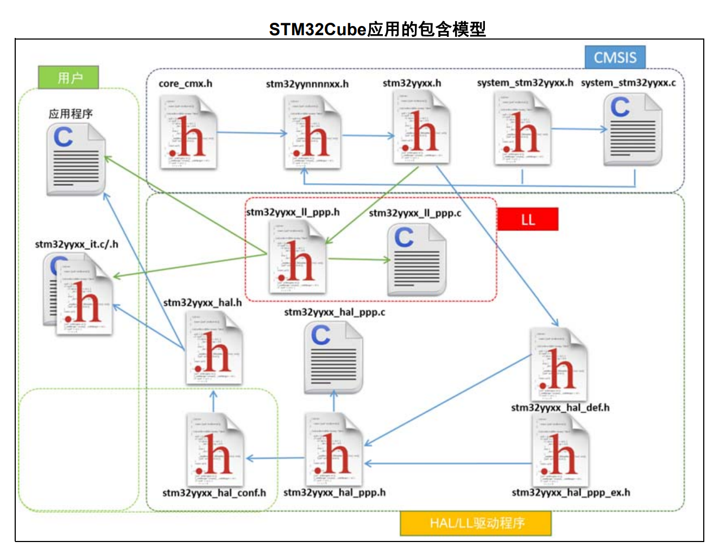

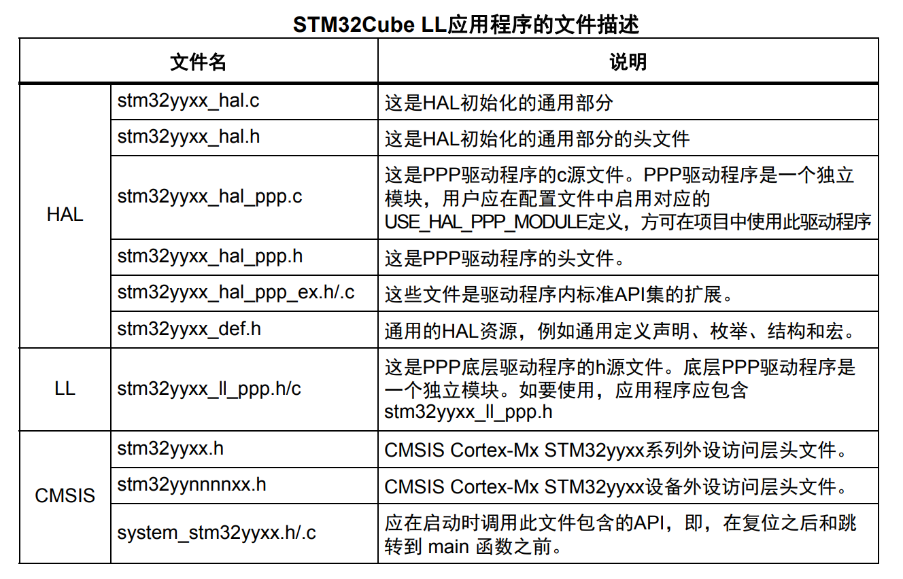

在 HAL/LL 库中，所有外设有 HAL 驱动程序，但并不是所有外设都有 LL 驱动程序。

STM32CubeMX 是一个用于 MCU 配置的工具软件，可以对 MCU 的资源和外设进行图形化的配置，并针对不同的 IDE 工具软件生成基于 HAL/LL 库的外设初始化程序和IDE 项目框架。做过 MCU 开发的人员都知道，  MCU 的初始化配置是比较麻烦的，也容易出错，而 STM32CubeMX 能对 MCU 的资源和外设进行图形化的配置并生成初始化代码，这极大地提高了开发效率。

## SPL vs HAL/LL

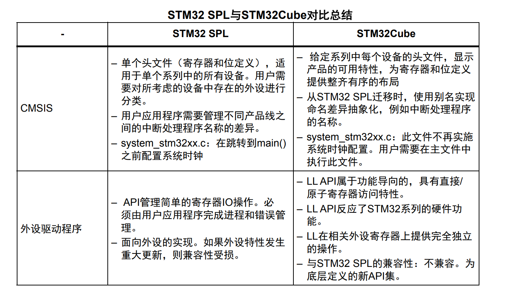

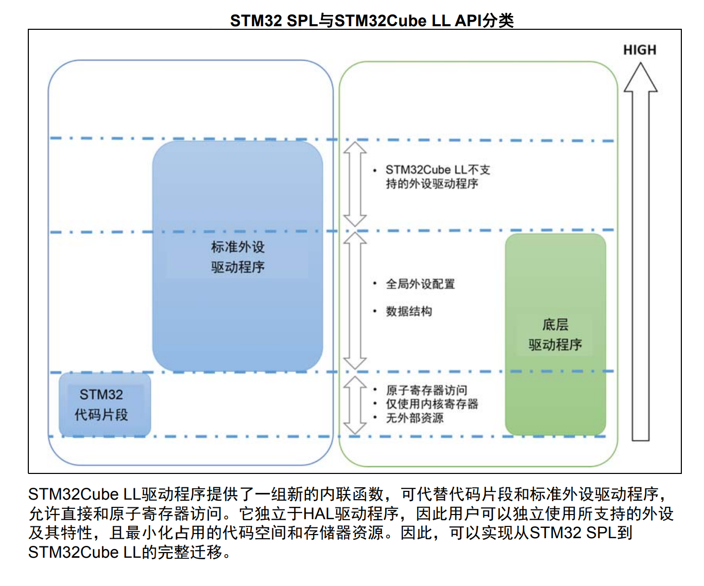

------

# STM32Cube 生态系统

- **STM32CubeMX** 
- **STM32CubeMX是一种图形工具，通过分步过程可以非常轻松地配置STM32微控制器和微处理器，以及为Arm® Cortex®-M内核或面向Arm® Cortex®-A内核的特定Linux®设备树生成相应的初始化C代码。**
    - 直观的STM32微控制器和微处理器选择
    - 丰富易用的图形用户界面，允许配置：
      - 支持自动冲突解决的引脚分配
      - 支持面向Arm® Cortex®-M内核带参数约束动态验证的外设和中间件功能模式
      - 支持动态验证时钟树配置
      - 带功耗结果估算的功耗序列
    - 生成与面向Arm® Cortex®-M内核的IAR Embedded Workbench®、MDK-ARM和STM32CubeIDE（GCC编译器）兼容的初始化C代码
    - 生成面向Arm® Cortex®-A内核（STM32微处理器）的部分Linux®设备树
    - 借助STM32PackCreator开发增强型STM32Cube扩展包
    - 将STM32Cube扩展包集成到项目中
    - 作为可在Windows®、Linux®和macOS®（macOS®是苹果公司在美国和其他国家与地区的商标）操作系统和64位Java运行环境上运行的独立软件提供 and other countries.) operating systems and 64-bit Java Runtime environment
  
- **STM32CubeIDE**

  - **STM32CubeIDE是一体式多操作系统开发工具，是STM32Cube软件生态系统的一部分。**
    - 通过STM32CubeMX来集成服务：STM32微控制器、微处理器、开发平台和示例项目选择引脚排列、时钟、外设和中间件配置项目创建和初始化代码生成具有增强型STM32Cube扩展包的软件和中间件
    - 基于Eclipse®/CDT™，支持Eclipse®插件、GNU C/C++ for Arm®工具链和GDB调试器
    - STM32MP1 系列：支持OpenSTLinux项目：Linux支持Linux
    - 其他高级调试功能包括：CPU内核、外设寄存器和内存视图实时变量查看视图系统分析与实时跟踪(SWV)CPU故障分析工具支持RTOS感知调试，包括Azure
    - 支持ST-LINK（意法半导体）和J-Link (SEGGER)调试探头
    - 从Atollic® TrueSTUDIO®和AC6 System Workbench for STM32 (SW4STM32)导入项目
    - 支持多种操作系统：Windows®、Linux®和macOS®，仅限64位版本
- **STM32Cubeprogrammer**

  - **STM32CubeProgrammer（STM32CubeProg）是一款用于编程STM32产品的全功能多操作系统软件工具。**
    - 擦除、编程、查看和验证设备Flash存储的内容
    - 支持Motorola S19、Intel HEX、ELF，以及二进制格式
    - 支持调试和自举程序接口：
      - ST-LINK调试探针（JTAG/SWD）
      - UART、USB DFU、I2C、SPI，以及CAN自举程序接口
    - 对外部存储器进行编程、擦除和验证操作，而外部Flash加载程序示例可以帮助用户为特定的外部存储器开发加载程序
    - 自动完成STM32编程（擦除、验证、编程、配置选项字节）
    - 支持OTP存储编程
    - 支持对选项字节编程和配置
    - 提供命令行界面，通过脚本处理实现自动化
    - ST-LINK固件升级
    - 支持通过“STM32 trusted package creator”工具创建安全固件
    - STM32MP1系列外设启动和刷写
    - 支持对STM32WB系列进行OTA编程
    - 支持多种操作系统：Windows、Linux、macOS
- **STM32CubeMonitor**

  - **STM32CubeMonitor系列工具能够实时读取和呈现其变量，从而在运行时帮助微调和诊断STM32应用。除了专业版本以外（电源、RF、USB-PD），多功能的STM32CubeMonitor还提供基于流量的图形化编辑器，以便轻松构建自定义操作面板和快速添加小部件，如计量、条形图和图表。借助非介入式监控，STM32CubeMonitor可保留应用的实时行为，并完美补充了执行应用分析的传统调试工具。**
    - 采用图形化基于流量的编辑器，无需编程即可构建操作面板
    - 通过ST-LINK（SWD或JTAG协议）可连接至任何STM32设备
    - 在目标应用运行期间，可同时向RAM进行实时变量读写
    - 从应用可执行文件擦除调试信息
    - 直接采集模式或快照模式
    - 侧重于感兴趣的应用行为的触发器
    - 支持将数据记录到文件中和重放，以进行详尽分析
    - 通过可配置的显示窗口（例如曲线和框）和大量小部件（如仪表、条形图和图表）提供自定义可视化
    - 多探头支持同时监控多个目标
    - 远程监控，原生支持多格式显示（PC、平板电脑、手机）
    - 直接支持Node-RED®开源社区
    - 支持多种操作系统：Windows®、Linux® Ubuntu®和macOS®
- **……**

------

# STM32 仿真器

- **ST-LINK**
  - **The STLINK-V3SET is a modular stand-alone debugging and programming probe for the STM8 and STM32 microcontrollers. It is composed of a main module and a complementary adapter board.**
    - Stand-alone probe with modular extensions
    - Self-powered through a USB connector (Micro-B)
    - USB 2.0 high-speed compatible interface
    - Direct firmware update support (DFU)
    - JTAG / serial wire debugging (SWD) specific features:
      - 3 to 3.6 V application voltage support and 5 V tolerant inputs
      - Flat cables STDC14 to MIPI10 / STDC14 / MIPI20 (connectors with 1.27 mm pitch)
      - JTAG communication support
      - SWD and serial wire viewer (SWV) communication support
    - SWIM specific features (only available with adapter board MB1440):
      - 1.65 to 5.5 V application voltage support
      - SWIM header (2.54 mm pitch)
      - SWIM low-speed and high-speed modes support
    - Virtual COM port (VCP) specific features:
      - 3 to 3.6 V application voltage support on the UART interface and 5 V tolerant inputs
      - VCP frequency up to 15 MHz
      - Available on STDC14 debug connector (not available on MIPI10)
    - Multi-path bridge USB to SPI/UART/I2C/CAN/GPIOs specific features:
      - 3 to 3.6 V application voltage support and 5 V tolerant inputs
    - Signals available on adapter board only (MB1440)
    - Drag-and-drop flash programming of binary files
      - Two-color LEDs: communication, power
- **J-LINK**

  - **J-Link debug probes are the most popular choice for optimizing the debugging and flash programming experience. Benefit from record-breaking flash loaders, up to 4 MB/s RAM download speed and the ability to set an [unlimited number of breakpoints ](https://www.segger.com/products/debug-probes/j-link/tools/software-highlights/flash-breakpoints/)in the flash memory of MCUs.**
    - Ultra-fast download speed
    - Unlimited breakpoints in flash memory ([Flash Breakpoints](https://www.segger.com/products/debug-probes/j-link/technology/flash-breakpoints/))
    - Real-Time Transfer technology for extended debug information
    - Built-in [virtual COM port functionality (VCOM)](https://www.segger.com/products/debug-probes/j-link/#vcom-functionality)
    - All popular devices are supported (Arm, RISC-V, Microchip, Renesas, SiLabs 8051, Cadence)
    - All popular debuggers are supported
    - Includes software and firmware updates
    - Includes use on all target devices currently supported, and on any that will be added
- **DAP-LINK**

  - **DAPLink是ARM官方开源的一个调试器方案，官方地址为[ARMmbed/DAPLink (github.com)](https://github.com/ARMmbed/DAPLink)，可以用来调试arm cortex内核的几乎所有单片机，最新出的M33，M85内核也支持调试。**
    - **全系列**Arm-cortex内核芯片的调试和烧录，ARM官方维护，后续新内核依然会支持
    - 一个**全功能USB转串口**（CDC），带硬件DTR和RTS，可以实现自动下载功能
    - 带**U盘拖拽烧录**功能，可以直接将hex或者bin文件拖拽到U盘实现烧录（仅支持烧录CBT6）
    - 适配**DAPLink V2** WINUSB版本，速度对比HID版本提升3到10倍，极大节约了下载时间
    - 支持**WEBUSB**功能，可以网页烧录固件，支持插入弹窗，无需担心不会用
    - 支持Keil，IAR，PyOCD等多种调试环境
- **……**

------
# ……

***
# 参考资料

> - [意法半导体-STMicroelectronics](https://www.st.com/content/st_com/zh.html)
> - [STM32 | 产品 | STM32 | MCU单片机 | 意法半导体STM | STMCU中文官网](https://www.stmcu.com.cn/Product/pro_detail/PRODUCTSTM32/product)
> - [STM32CubeMX - STM32Cube initialization code generator - STMicroelectronics](https://www.st.com/en/development-tools/stm32cubemx.html)
> - [STM32CubeIDE - Integrated Development Environment for STM32 - STMicroelectronics](https://www.st.com/en/development-tools/stm32cubeide.html)
> - [STM32CubeProg - STM32CubeProgrammer software for all STM32 - STMicroelectronics](https://www.st.com/en/development-tools/stm32cubeprog.html)
> - [STM32CubeMonitor - 在运行时测试STM32应用的监控工具 - 意法半导体STMicroelectronics](https://www.st.com/zh/development-tools/stm32cubemonitor.html)
> - [STM32微控制器软件 - 意法半导体STMicroelectronics](https://www.st.com/zh/embedded-software/stm32-embedded-software.html)
> - [STM32标准外设软件库 - 意法半导体STMicroelectronics](https://www.st.com/zh/embedded-software/stm32-standard-peripheral-libraries.html)
> - [STM32 standard peripheral library to STM32Cube low-layer migration](https://www.st.com/resource/zh/application_note/an5044-stm32-standard-peripheral-library-to-stm32cube-lowlayer-migration-stmicroelectronics.pdf)
> - [STSW-LINK004 - STM32 ST-LINK utility - STMicroelectronics](https://www.st.com/en/development-tools/stsw-link004.html)
> - [SEGGER J-Link debug probes](https://www.segger.cn/products/debug-probes/j-link/)
> - [DAPLink](https://daplink.io/)
> - [STM32Cube高效开发教程（基础篇）-异步社区-致力于优质IT知识的出版和分享 (epubit.com)](https://www.epubit.com/bookDetails?id=UB77e58e05a5ea9&typeName=搜索)
> - [STM32Cube高效开发教程（基础篇）-配套视频 ---> Kevin_WWW的哔哩哔哩视频 (bilibili.com)](https://space.bilibili.com/3805161?spm_id_from=333.999.0.0)
> - [稚晖君的个人空间-稚晖君个人主页-哔哩哔哩视频 (bilibili.com)](https://space.bilibili.com/20259914?spm_id_from=333.999.0.0)
> - [strongerHuang的个人空间-strongerHuang个人主页-哔哩哔哩视频 (bilibili.com)](https://space.bilibili.com/416169430?spm_id_from=333.999.0.0)
> - [硬汉嵌入式的个人空间-硬汉嵌入式个人主页-哔哩哔哩视频 (bilibili.com)](https://space.bilibili.com/678329477/?spm_id_from=333.999.0.0)
> - [正点原子官方的个人空间-正点原子官方个人主页-哔哩哔哩视频 (bilibili.com)](https://space.bilibili.com/394620890?spm_id_from=333.999.0.0)
> - [江协科技的个人空间-江协科技个人主页-哔哩哔哩视频 (bilibili.com)](https://space.bilibili.com/383400717?spm_id_from=333.999.0.0)
> - [keysking的个人空间-keysking个人主页-哔哩哔哩视频 (bilibili.com)](https://space.bilibili.com/6100925?spm_id_from=333.999.0.0)

