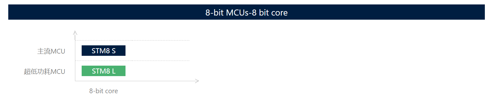
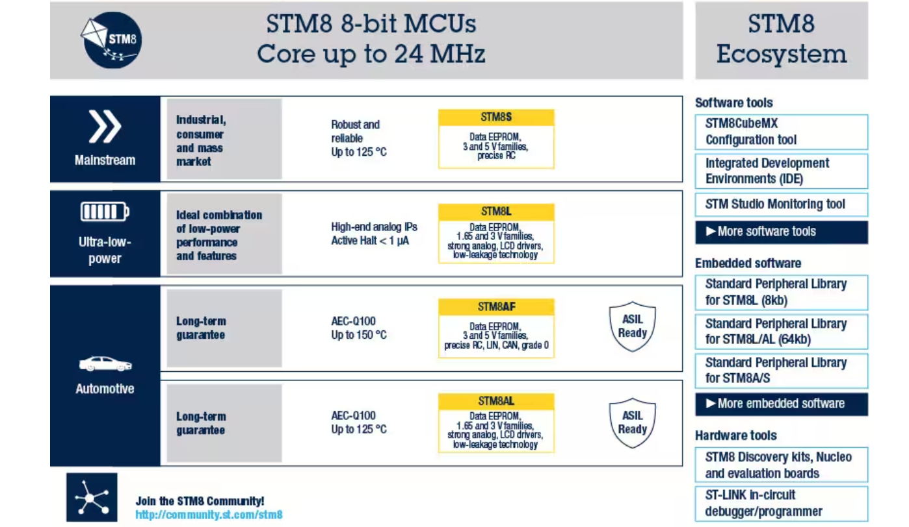

# STM8 8位MCU

意法半导体的 8 位微控制器平台基于高性能 8 位内核和先进外设集。该平台采用意法半导体专有的130nm 嵌入式非易失性存储器技术制造而成。

STM8 的增强型堆栈指针操作、高级寻址模式和新指令让用户能够实现快速、安全的开发。STM8平台支持4个产品系列：

- [STM8S](https://www.st.com/content/st_com/zh/products/microcontrollers-microprocessors/stm8-8-bit-mcus/stm8s-series.html) - 主流MCU
- [STM8L](https://www.st.com/content/st_com/zh/products/microcontrollers-microprocessors/stm8-8-bit-mcus/stm8l-series.html) - 超低功耗MCU
- [STM8AF](https://www.st.com/content/st_com/zh/products/microcontrollers-microprocessors/stm8-8-bit-mcus/stm8af-series.html) 和 [STM8AL](https://www.st.com/content/st_com/zh/products/microcontrollers-microprocessors/stm8-8-bit-mcus/stm8al-series.html) - 汽车用MCU

## STM8 MCUs now available in 8-pin package!

The STM8 Series expands our product portfolio in smaller pin count packages, introducing two part numbers in a SO8 package.

- [STM8S001](https://www.st.com/content/st_com/en/products/microcontrollers/stm8-8-bit-mcus/stm8s-series/stm8s-value-line/stm8s001j3.html) offers an outstanding set of features with top-notch core processing speed, system control, memory size, communication peripherals, and analog functions.
- [STM8L001](https://www.st.com/content/st_com/en/products/microcontrollers/stm8-8-bit-mcus/stm8l-series/stm8l-value-line/stm8l001j3.html) targets low-voltage and power-efficient designs, providing minimalist yet essential feature set.
- [STM8L050](https://www.st.com/content/st_com/en/products/microcontrollers/stm8-8-bit-mcus/stm8l-series/stm8l-value-line/stm8l050j3.html) delivers economy and performance for resource-constrained products.
- [STM8-SO8-DISCO](https://www.st.com/content/st_com/en/products/evaluation-tools/product-evaluation-tools/mcu-eval-tools/stm8-mcu-eval-tools/stm8-mcu-eval-boards/stm8-so8-disco.html) lets users evaluate all three STM8 variants currently available in the popular 8-pin SO8 package.

Configure easily your STM8 MCU using our free configuration tool with user-friendly GUI, the [STM8CubeMX](https://www.st.com/content/st_com/zh/products/development-tools/software-development-tools/stm8-software-development-tools/stm8-configurators-and-code-generators/stm8cubemx.html). Including several intuitive wizards to help significantly reduce development effort, time and cost. [STM8CubeMX](https://www.st.com/content/st_com/zh/products/development-tools/software-development-tools/stm8-software-development-tools/stm8-configurators-and-code-generators/stm8cubemx.html) is available for Windows®, Linux®and macOS® operating systems.

***

# Some ideas

- STM32的某些低端芯片价格足够低廉……用来替换STM8使用，大部分场景是可以的。
- 国产的 32 位单片机也行，但是有点大材小用了。**平移替换某些型号的 STM32 问题不大。**
- STC芯片 -> 一个神奇的国产厂商   [深圳国芯人工智能有限公司 (stcai.com)](https://www.stcai.com/)
- ……

***

# 参考资料

> - [STM8 8位MCU微控制器 - 意法半导体STMicroelectronics](https://www.st.com/zh/microcontrollers-microprocessors/stm8-8-bit-mcus.html)
> - [STM8 | 产品 | STM32/STM8 | MCU单片机 | 意法半导体STM | STMCU中文官网](https://www.stmcu.com.cn/Product/pro_detail/PRODUCTSTM8/product)
> - [STM8CubeMX - STM8Cube配置和报告工具 - 意法半导体STMicroelectronics](https://www.st.com/zh/development-tools/stm8cubemx.html)
> - [STM8 软件开发套件 - 意法半导体STMicroelectronics](https://www.st.com/zh/development-tools/stm8-software-development-tools.html)
> - [STMCU中文官网](https://www.stmcu.com.cn/university/course)
> - [STVD-STM8 - 用于开发ST7和STM8应用的ST可视化开发IDE - 意法半导体STMicroelectronics](https://www.st.com/zh/development-tools/stvd-stm8.html)
> - [CXSTM8 - STM8系列的C编译器和相关工具 - 意法半导体STMicroelectronics](https://www.st.com/zh/partner-products-and-services/cxstm8.html)
> - [IAR Embedded Workbench for STM8 - Functional Safety - 集成开发环境。 - 意法半导体STMicroelectronics](https://www.st.com/zh/partner-products-and-services/iar-embedded-workbench-for-stm8-functional-safety.html)
> - [【龙顺宇STM8单片机教程】51单片机过渡32单片机的好“跳板”_哔哩哔哩_bilibili](https://www.bilibili.com/video/BV12K4y1W758/?spm_id_from=333.337.search-card.all.click&vd_source=e584d0deb11ea8cf61295d72fc11f802)
> - [【众拳】剑齿虎STM8库函数视频教程-刘洋边讲边写_哔哩哔哩_bilibili](https://www.bilibili.com/video/BV18E411h74Z/?spm_id_from=333.337.search-card.all.click&vd_source=e584d0deb11ea8cf61295d72fc11f802)
