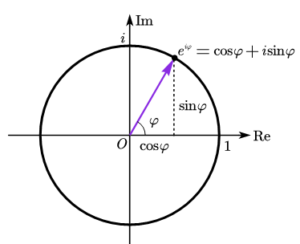

***

$$
e^{i\varphi}=\cos \varphi +i\sin \varphi
$$
$$
e^{i\pi}+1=0
$$

***

## 参考资料

> - [Leonhard Euler | Biography, Education, Contributions, & Facts | Britannica](https://www.britannica.com/biography/Leonhard-Euler)
